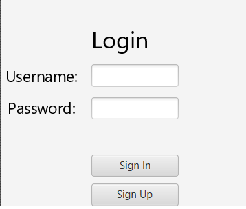
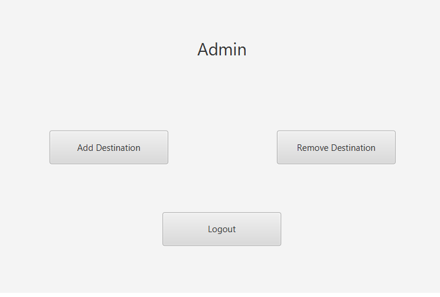
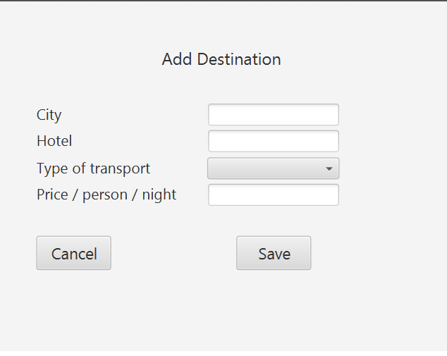
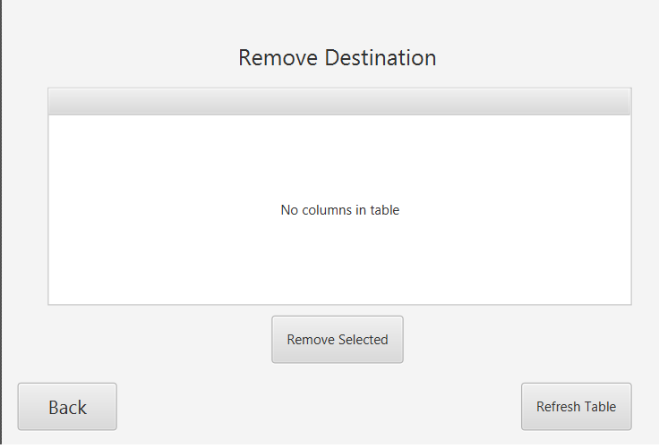
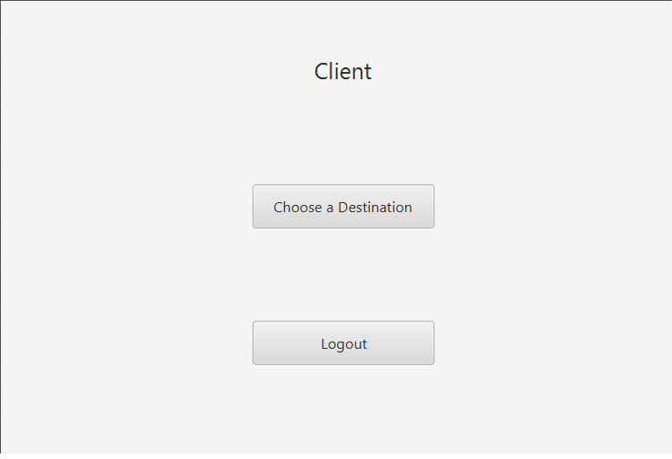
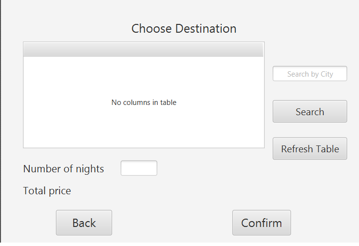

# turism4futurism

**Contributors**

- Ciceu Timea
- Ciun Sebastian 
---

**Plugins used**

 - Java 15
 - JavaFX
 - Nitrite database
 - Gradle
---

**Application description**

This application facilitates the travel and accommodation of the client in the desired destinations.

---

**Sign up**

At the beginning, every user must create a new account. There are two types of accounts:
 - Admin
 - Client
 
 
 
---

**Log in**

After creating the account, the user will be able to log in.

---

**Admin account**

After logging in, the admin will be redirected to the admin window. Here are three different options:
  - Add Destination
  - Remove Destination
  - Log out
  

---

**Add destination**

In this window the admin can add new destinations introducing the city, the hotel, the type of transport and the price/night for a person

---

**Remove destination**

If a destination is not available anymore, the admin can remove it from this window. Firstly, the admin must refresh the table to see all the destinations, then he can select the destination which he want to remove and press the "Remove Selected" button.

---

**Client account**

The other user is client. Here there are two different options:
  - Choose a Destination
  - Log out
 

---

**Choose a destination**

Firstly, the client must refresh the table to see all available destinations. He can search a destination by the city name. Also, the client can sort the destinations. After choosing the destination, the client must introduce the number of nights he wants to spend. After that, the price for a person will be listed. To confirm the excursion, the client must press the "Confirm" button.

---

